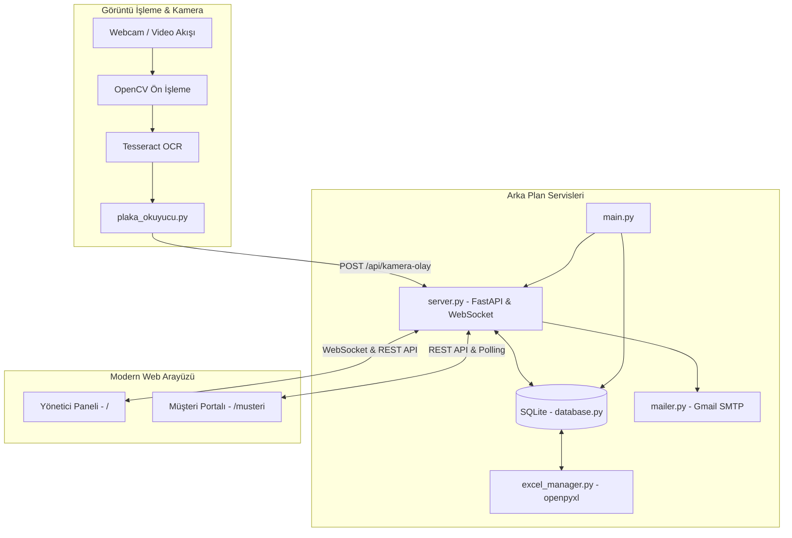

# 🅿️ ParkOS - Akıllı Otopark İşletim Sistemi (Smart Parking & Mobility OS)

[](https://www.python.org/)
[](https://fastapi.tiangolo.com/)
[](https://opencv.org/)
[](https://www.sqlite.org/)
[](https://developer.mozilla.org/en-US/docs/Web/API/WebSockets_API)
[](https://opensource.org/licenses/MIT)

> **ParkOS; Computer Vision (Görüntü İşleme), Asenkron Web Mimarisi (FastAPI + WebSocket), Dinamik Tarife Motoru, OTP Doğrulamalı Müşteri Portalı, Abonman Mimarisi ve Akıllı Kapasite Yönetimini bir araya getiren yeni nesil bir akıllı otopark işletim sistemidir.**

---

## 📌 Proje Genel Bakış

Bu sistem; fiziksel kamera görüntüsünden araç plakalarını yapay görme teknikleriyle (OpenCV + Tesseract OCR) gerçek zamanlı tespit eden, araçların otoparkta kaldığı süreyi dinamik saniye/ücret formülleriyle hesaplayan, müşterilerin şifresiz e-posta OTP ile bağlanıp sanal kartla ödeme yapabildiği ve abonmanlık satın alabildiği kapsamlı bir IoT & Web ekosistemidir.

### 🎯 Çözülen Temel Problemler
1. **Manuel Fiş ve Bilet İsrafı**: Plaka otomatik okunur; kağıt bilet veya otopark kartı ihtiyacı sıfırlanır.
2. **Kuyruklar ve Çıkış Gecikmeleri**: Müşteri cep telefonundan aracın anlık borcunu görüp ödeyebilir; çıkışta bariyer beklemeden otomatik açılır.
3. **Ödenmemiş Araç Kaçakları**: Borcu olan araçların çıkış yapması bariyer ve sistem seviyesinde engellenir.
4. **Kapasite ve Park Yeri Kaosu**: Standart ve Abonmanlı araç yerleri akıllı taşma algoritmasıyla dinamik yönetilir.

---

## 🌟 Öne Çıkan Yetenekler & Mimari Özellikler

### 1. 👁️ Gerçek Zamanlı Plaka Algılama (Computer Vision & ALPR)
* **Görüntü Ön İşleme**: Gri tonlama, Gaussian Blur, Canny kenar tespiti ve kontur analizi ile plaka bölgesi (ROI) izole edilir.
* **Tesseract OCR Optimizasyonu**: Çoklu okuma ve ardışık doğrulama filtresi (Minimum 4 ardışık eşleşme) sayesinde sahte plaka okumaları engellenir.
* **Canlı HUD Göstergesi**: Kamera penceresi üzerinde canlı boş yer sayaçları, tespit edilen plaka, giriş/çıkış durumu ve borç ikazları HUD olarak çizilir.

### 2. ⚡ Dinamik Tarife & Milisaniyelik Ücret Hesaplama Motoru
* Yönetici panelinden tarife saniye ve birim fiyat olarak anında güncellenebilir (Örn: *5 saniye = 1.00 ₺*).
* Süre ve ücret hesabı milisaniye hassasiyetinde tutulur; içeride kalınan her saniye canlı WebSocket akışıyla ekrana yansır.

### 3. 🅿️ Akıllı Kapasite & Fiziksel Taşma Algoritması
* **2 Temiz Park Sınıfı**: **Abonmansızlar (Standart)** ve **Abonmanlılar** (Haftalık & Aylık).
* **Fiziksel Taşma Mantığı**:
  * Abonmanlı araçlar öncelikle kendilerine ayrılan alana park eder.
  * Abonman kapasitesi dolduğunda, yeni gelen abonmanlı araçlar standart alana taşar.
  * Standart alan dolduğunda standart araçların girişi engellenir; kalan yerler abonmanlara rezerve tutulur.
  * Otopark tamamen dolduğunda hiçbir aracın girişine izin verilmez (fiziksel kapasite koruması).
* **Test Kolaylığı**: Yönetici panelinden tek tıkla `1 Normal + 1 Abonman` veya `10 Normal + 5 Abonman` modları arasında geçiş yapılabilir.

### 4. 🛡️ Bariyer Güvenliği & 30 Saniye Çıkış Toleransı
* **Ödemesiz Çıkış Yasağı**: Borcu `0.00 TL` olmayan araçlar için çıkış izni verilmez (`CIKIS_ENGELLENDI`).
* **30 Saniye Dondurma**: Müşteri online ödeme yaptığı anda ücret sayacı **30 saniye boyunca dondurulur (0.00 TL)**.
* **Geri Sayım & Ek Borç**: 30 saniye içinde çıkılmazsa tolerans hakkı sona erer, dondurulan süre de dahil edilerek yeni tarife üzerinden ek borç oluşturulur.

### 5. 📩 Şifresiz Güvenli Müşteri Girişi (E-Posta OTP)
* Müşterinin şifre hatırlamasına gerek yoktur. Sadece plakasını girer, sistem kayıtlı e-posta adresine 6 haneli tek kullanımlık doğrulama kodu (OTP) gönderir.
* Gmail SMTP entegrasyonuyla şık HTML formatında teslim edilir; test aşamasında terminal loglarına da anlık basılır.

### 6. ⭐ Abonman Paketi Yönetimi & 0.00 TL Muafiyeti
* Müşteriler giriş ekranından veya dashboard üzerinden **Haftalık** veya **Aylık** abonman satın alabilir.
* Aktif abonmanı olan araçlar süreleri boyunca **0.00 TL** ücretle beklemesiz çıkış hakkına sahiptir.
* Mevcut abonman varken tekrar paket alındığında yeni gün sayısı mevcut sürenin sonuna otomatik eklenir.

### 7. 📊 Gerçek Zamanlı Excel Senkronizasyonu (`openpyxl`)
* Veritabanına işlenen her giriş, çıkış, süre, tahsil edilen ücret ve müşteri türü anında `otopark_kayitlari.xlsx` dosyasına yazılır.
* Otomatik başlık renklendirmesi, kenarlıklar ve biçimlendirilmiş para birimi formatı içerir.

---

## 🏗️ Sistem Mimarisi



---

## 📂 Proje Dizin Yapısı

```text
PlakaProjesi/
├── main.py                      # Sistemi (Sunucu + Kamera) ayağa kaldıran ana başlatıcı
├── server.py                    # FastAPI REST API ve WebSocket sunucusu
├── database.py                  # SQLite veritabanı, ücret ve kapasite motoru
├── plaka_okuyucu.py             # OpenCV & Tesseract plaka tanıma motoru
├── mailer.py                    # Gmail SMTP e-posta ve OTP gönderim servisi
├── excel_manager.py             # Excel raporlama ve senkronizasyon modülü
├── baslat.bat                   # Tek tıkla otomatik kontrol ve başlatıcı script
├── requirements.txt             # Gerekli Python bağımlılıkları
├── .env.example                 # Çevre değişkenleri örnek şablonu
├── .gitignore                   # Hassas dosyaları ve cache'leri engelleyici kurallar
├── otopark.db                   # SQLite veritabanı dosyası
├── otopark_kayitlari.xlsx       # Canlı senkronize olan Excel rapor dosyası
├── static/                      # Web arayüz varlıkları (Vanilla JS + CSS)
│   ├── index.html               # Yönetici Kontrol Paneli
│   ├── app.js                   # Yönetici Paneli mantığı & WebSocket dinleyicisi
│   ├── style.css                # Yönetici Paneli modern stil dosyası
│   ├── musteri.html             # Müşteri Portalı & Ödeme Ekranı
│   ├── musteri.js               # Müşteri Portalı canlı süre & ödeme mantığı
│   └── musteri.css              # Müşteri Portalı responsive stil dosyası
└── testler/                     # Otomatik Birim & Entegrasyon Testleri
    ├── test_kapasite_yonetimi.py       # Kapasite kotaları ve doluluk testi
    ├── test_direct_abonman_ve_cikis.py # 0 TL çıkış ve direkt abonman testi
    ├── test_musteri_flow.py            # OTP doğrulaması ve müşteri akış testi
    ├── test_abonman_pazarlama.py       # Abonman teklif ve pazarlama testi
    ├── test_tarife.py                  # Dinamik ücret hesaplama testi
    ├── test_excel.py                   # Excel senkronizasyon testi
    └── test_system.py                  # Çekirdek sistem testi
```

---

## 🚀 Hızlı Başlangıç & Kurulum

### Yöntem 1: Tek Tıkla Başlatma (Windows)
Proje klasöründeki **`baslat.bat`** dosyasına çift tıklayın.
* Bilgisayarınızda Python olup olmadığını kontrol eder.
* Eksik kütüphaneleri `requirements.txt` dosyasından **otomatik kurar**.
* Web tarayıcısını açarak sistemi hazır hale getirir.

---

### Yöntem 2: Manuel Kurulum

1. **Depoyu Klonlayın:**
   ```bash
   git clone https://github.com/KULLANICI_ADINIZ/ParkOS.git
   cd ParkOS
   ```

2. **Sanal Ortam Oluşturun ve Aktif Edin:**
   ```bash
   python -m venv venv
   # Windows için:
   venv\Scripts\activate
   # macOS/Linux için:
   source venv/bin/activate
   ```

3. **Bağımlılıkları Yükleyin:**
   ```bash
   pip install -r requirements.txt
   ```

4. **Çevre Değişkenlerini Ayarlayın:**
   `.env.example` dosyasını `.env` olarak kopyalayın ve SMTP bilgilerinizi tanımlayın:
   ```bash
   cp .env.example .env
   ```

5. **Sistemi Başlatın:**
   ```bash
   python main.py
   ```

---

## 🌐 Arayüz Haritası ve Erişim Linkleri

| Sayfa | Adres | Açıklama |
|---|---|---|
| 🖥️ **Yönetici Paneli** | `http://localhost:8000` | Canlı araç listesi, otopark doluluk oranları, manuel giriş-çıkış, kapasite ayarları |
| 📱 **Müşteri Portalı** | `http://localhost:8000/musteri` | OTP giriş, canlı süre ve borç sayacı, sanal kartla ödeme, abonman satın alma |
| 📚 **Swagger API Docs** | `http://localhost:8000/docs` | FastAPI otomatik interaktif OpenAPI / Swagger dokümantasyonu |
| 📊 **Excel Raporu** | `otopark_kayitlari.xlsx` | Arka planda gerçek zamanlı güncellenen kurumsal kayıt tablosu |

> **📲 Mobil Erişim (Aynı Wi-Fi):** Konsolda belirtilen yerel IP adresiyle (Örn: `http://192.168.1.35:8000/musteri`) aynı ağa bağlı cep telefonlarından müşteri paneli gerçek bir mobil uygulama gibi kullanılabilir.

---

## 🧪 Otomatik Testler

Proje bünyesinde tüm iş kurallarını (business logic) denetleyen 7 adet test paketi bulunmaktadır. Testleri çalıştırmak için:

```bash
# Kapasite taşması ve doluluk testleri:
python testler/test_kapasite_yonetimi.py

# 0 TL çıkış muafiyeti ve direkt abonman testleri:
python testler/test_direct_abonman_ve_cikis.py

# Müşteri OTP kayıt ve giriş testleri:
python testler/test_musteri_flow.py
```

---

## 🛠️ Kullanılan Teknolojiler

* **Backend & API:** Python 3.10+, FastAPI, Uvicorn, WebSockets, Pydantic
* **Computer Vision & OCR:** OpenCV (cv2), Tesseract OCR (pytesseract), Imutils, NumPy
* **Veritabanı & Dosya Yönetimi:** SQLite3, OpenPyXL (Excel)
* **İletişim & Entegrasyon:** Python SMTPLib (Gmail App Password), Requests, QRCode
* **Frontend:** Vanilla JavaScript (ES6+), HTML5 Semantic Elements, Modern Glassmorphism CSS

---

## 🤖 Geliştirme Yaklaşımı (Development Methodology)

Bu proje, modern **AI Pair-Programming** ve **AI-Assisted Architecture** pratikleri kullanılarak hayata geçirilmiştir. 
* **Sistem Mimarisi & Ürün Yönetimi:** İş kuralları (business logic), kapasite taşma algoritmaları, mükerrer çıkış ve yarış durumlarının (race condition) tespiti, UI/UX deneyimi ve test senaryoları insan gözetiminde titizlikle kurgulanmıştır.
* **Hızlı Geliştirme:** Yapay zeka asistanları; hızlı prototipleme, temiz kod üretimi, birim testlerinin otomasyonu ve hata ayıklama (debugging) aşamalarında bir çarpan (force multiplier) olarak aktif rol almıştır.

---

## 📄 Lisans

Bu proje [MIT Lisansı](LICENSE) kapsamında açık kaynak olarak paylaşılmıştır. Dilediğiniz gibi geliştirebilir, fork'layabilir ve portfolyonuzda sergileyebilirsiniz.
